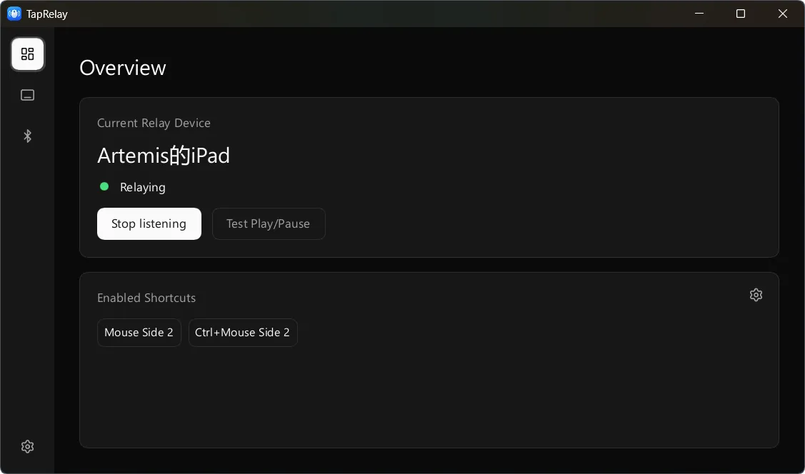
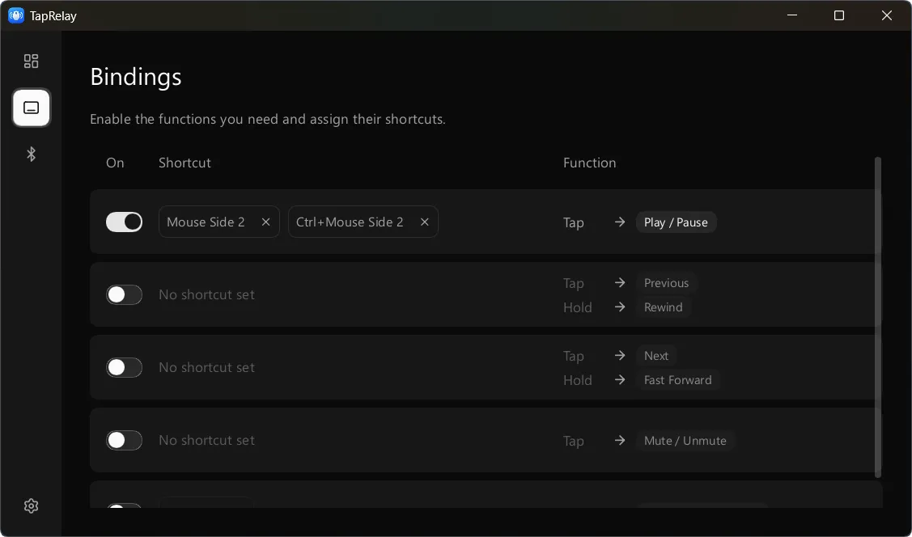

[前往中文版本 » ](README.zh-cn.md)

# TapRelay

Turn keyboard and mouse shortcuts on your computer into Bluetooth commands to control another device.

This is a personal project, so device compatibility is at the *works on my machine* stage.

## Requirements

- Windows x64 (*macOS support is not implemented yet, as I haven't bought the Mac needed for it.*)
- A Bluetooth adapter and driver that support Bluetooth Low Energy (BLE) peripheral mode.
- A receiver that accepts media controls over BLE HID.

## Download and use

*Only a portable version is currently available.*

1. Download `TapRelay_<version>_Windows_x64.zip` from [Releases](https://github.com/AuroraZiling/TapRelay/releases) and extract it to a writable folder.
2. Run `TapRelay.exe`. TapRelay requests administrator access by default. If you cancel the request, it continues without elevation, but shortcuts may not work in applications running as administrator.
3. In the setup wizard, enable the functions you need and assign shortcuts.
4. Pair and connect the receiver to the PC in system Bluetooth settings, then select it in TapRelay.
5. Start playback on the receiver and use **Test Play/Pause**.

## Screenshots





## Settings and limitations

- TapRelay stores `config.json` and the `logs/` folder beside the executable.
- Use `TapRelay.exe --log-level debug` to choose the startup log level: `off`, `error`, `warn`, `info` (default), `debug`, or `trace`.
- When passthrough is off, Shift, Ctrl, Alt and Win go directly to this computer. Matching shortcuts consume only their primary key or mouse button; modifier keys retain their normal behavior, including Alt/Win system actions.
- A Bluetooth connection and a usable HID session are separate states. If the receiver is paired but the session is not ready, check its connection to the PC and the status shown in TapRelay.
- Input hooks and Bluetooth behavior need testing on real hardware. Automated tests do not establish compatibility with a particular receiver, driver or game.
- Native Bluetooth and input support is currently implemented only for Windows.

## Build

Build on Windows with Rust, the MSVC C++ build tools and a Windows SDK. The build script requires the SDK resource compiler (`rc.exe`).

Local builds and releases use the Rust `nightly` channel, configured in `rust-toolchain.toml` and the release workflow.

```powershell
cargo run --locked -p taprelay-app
```

Development builds retain source locations for project backtraces and omit dependency debug information. For breakpoints and variable inspection, use `cargo run --locked -p taprelay-app --profile debugging`.

To build the release executable locally:

```sh
cargo rustc --release --locked -p taprelay-app -- -C target-feature=+crt-static
```

The output is `target/release/taprelay.exe`.

## Feedback and contributions

Submit bugs and feature requests to [Issues](https://github.com/AuroraZiling/TapRelay/issues).<br>
Read the [Contributing guide](CONTRIBUTING.md) before submitting changes.<br>
Follow the [Code of conduct](CODE_OF_CONDUCT.md) when participating in discussions.

## Acknowledgements

- The Genshin Impact team and guide video creators: thank you for the work that inspired TapRelay.
- My computer: thank you for providing a reliable Windows test environment.
- Tibo: thank you to the Chief Reset Officer for supporting my Codex usage quota.
- [@DearVa](https://github.com/DearVa)

## License

TapRelay is licensed under [GPL-3.0-only](LICENSE).

See [THIRD_PARTY_NOTICES](THIRD_PARTY_NOTICES.md) for copied source code, embedded icons and special attribution requirements.
