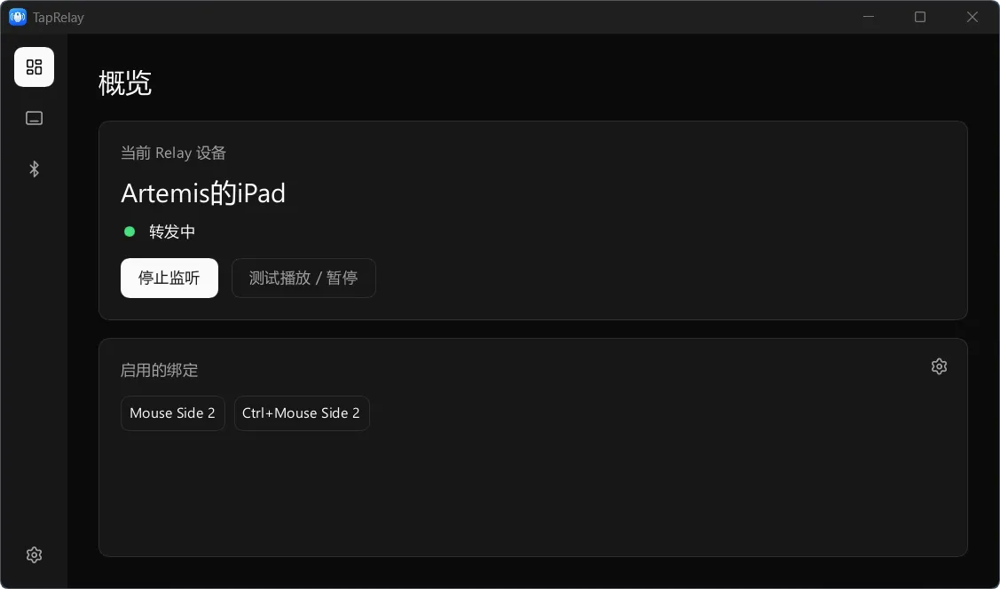
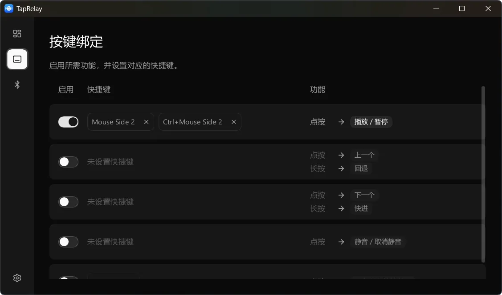

[Go to English Version » ](README.md)

# TapRelay

将电脑的键鼠快捷键转换为蓝牙指令以用于控制另一台设备。

作为个人项目，设备兼容性达到 *works on my machine* 的水平。

## 运行条件

- Windows x64 (*MacOS 环境所需的设备尚未购买，故暂无相关实现*)
- 支持低功耗蓝牙（BLE）外围设备模式的蓝牙适配器及驱动。
- 能通过 BLE HID 接收媒体控制指令的接收设备。

## 下载与使用

*目前仅提供便携版*

1. 从 [Releases](https://github.com/AuroraZiling/TapRelay/releases) 下载 `TapRelay_<version>_Windows_x64.zip`，解压到可写入的文件夹。
2. 运行 `TapRelay.exe`。TapRelay 默认请求管理员权限；取消授权后仍会以普通权限运行，但快捷键可能无法用于以管理员身份运行的应用。
3. 在设置向导中启用所需功能，并设置快捷键。
4. 在系统蓝牙设置中将接收设备与电脑配对并连接，然后在 TapRelay 中选择它。
5. 在接收设备上开始播放，使用“测试播放/暂停”。

## 截图





## 设置与限制

- TapRelay 将 `config.json` 和 `logs/` 文件夹保存在可执行文件旁。
- 蓝牙已连接和 HID 会话可用是不同状态。如果已配对但会话未就绪，检查接收设备与电脑的连接，以及 TapRelay 中显示的状态。
- 输入钩子和蓝牙行为需要在真实硬件上测试。自动化测试不能证明某个接收设备、驱动或游戏与 TapRelay 兼容。
- 原生蓝牙和输入功能目前仅在 Windows 上实现。

## 构建

在 Windows 上构建，需要 Rust、MSVC C++ 构建工具和 Windows SDK。构建脚本需要 SDK 中的资源编译器（`rc.exe`）。

本地构建和发布均使用 Rust `nightly` 通道，在 `rust-toolchain.toml` 和发布流程中配置。

```powershell
cargo run --locked -p taprelay-app
```

在本地构建发布版本：

```sh
cargo rustc --release --locked -p taprelay-app -- -C target-feature=+crt-static
```

输出文件为 `target/release/taprelay.exe`。

## 反馈与贡献

Bug、功能建议提交到 [Issues](https://github.com/AuroraZiling/TapRelay/issues)  
提交改动前阅读[贡献指南](CONTRIBUTING.md)  
参与讨论时遵守[行为规范](CODE_OF_CONDUCT.md)

## 致谢

- 原神项目组和攻略视频制作者：感谢他们的作品启发了 TapRelay。
- 我的电脑：感谢它提供不掉链子的 Windows 测试环境。
- Tibo：感谢 Chief Reset Officer 在 Codex 上的额度支持。
- [@DearVa](https://github.com/DearVa)

## 许可

TapRelay 使用 [GPL-3.0-only](LICENSE) 许可。

复制的源码、内嵌图标及特殊署名要求见 [THIRD_PARTY_NOTICES](THIRD_PARTY_NOTICES.md)。
